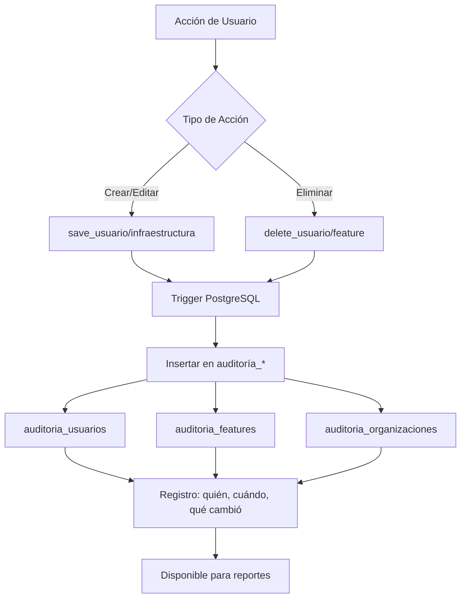
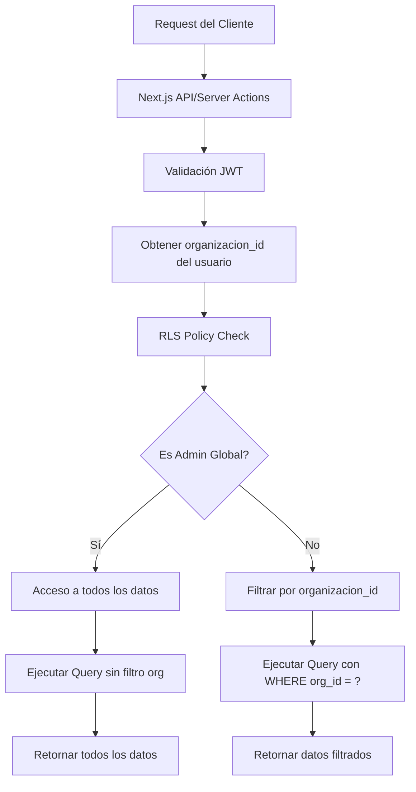
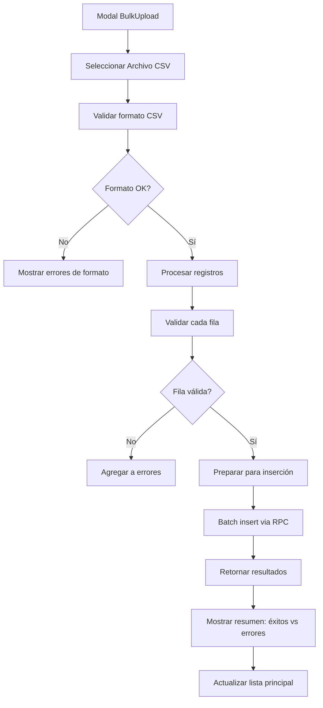

# 🔄 Diagrama de Flujo - Autenticación y Acceso

```mermaid
graph TD
    A[Usuario visita /login] --> B[LoginForm Component]
    B --> C{Login Action}
    C -->|Éxito| D[Supabase Auth]
    C -->|Error| E[Mostrar Error]
    D --> F[JWT Token]
    F --> G[get_mi_perfil_seguro()]
    G --> H[Datos de Usuario + Rol]
    H --> I{Tipo de Rol}
    I -->|ID 4| J[Admin Dashboard]
    I -->|ID 7| K[PM Dashboard]
    I -->|ID 3| L[Supervisor Dashboard]
    I -->|Otros| M[Técnico Dashboard]
    J --> N[get_admin_full_telemetry()]
    K --> O[get_pm_dashboard_stats()]
    N --> P[Mostrar Estadísticas Globales]
    O --> Q[Mostrar Estadísticas por Organización]
```

# 🔄 Diagrama de Flujo - Gestión de Usuarios

```mermaid
graph TD
    A[Dashboard de Usuarios] --> B[useUsuarios Hook]
    B --> C[get_usuarios_dashboard()]
    C --> D[PostgreSQL - JOIN usuarios + roles + organizaciones]
    D --> E[Retornar Lista de Usuarios]
    E --> F[Tabla de Usuarios]
    F --> G{Acción del Usuario}
    G -->|Crear| H[UsuarioModal - Crear]
    G -->|Editar| I[UsuarioModal - Editar]
    G -->|Eliminar| J[Confirmación]
    H --> K[fn_save_usuario_seguro()]
    I --> K
    K --> L[Validar Permisos]
    L --> M{Permisos OK?}
    M -->|Sí| N[Guardar/Actualizar en BD]
    M -->|No| O[Error de Permiso]
    J --> P[fn_delete_usuario_seguro()]
    P --> Q[Soft Delete + Auditoría]
```

# 🔄 Diagrama de Flujo - Gestión de Organizaciones

```mermaid
graph TD
    A[Dashboard Admin] --> B[useOrganizaciones Hook]
    B --> C[get_organizaciones_dashboard()]
    C --> D[PostgreSQL - JOIN organizaciones + usuarios_count + proyectos_count]
    D --> E[Retornar Organizaciones con Conteos]
    E --> F[Tarjetas de Organizaciones]
    F --> G{Acción del Usuario}
    G -->|Crear Nueva| H[OrgModal - Crear]
    G -->|Ver Detalles| I[Página de Organización]
    H --> J[create_org_with_pm_rpc_seguro()]
    J --> K[Crear Organización + PM]
    K --> L[Enviar Email de Invitación]
    L --> M[PM completa registro]
```

# 🔄 Diagrama de Flujo - Sistema de Mapas

```mermaid
graph TD
    A[Componente Map] --> B[useMapState Hook]
    B --> C{Usuario mueve mapa}
    C -->|Nuevo BBox| D[get_infra_by_bbox_seguro()]
    D --> E[PostgreSQL - Features en BBox]
    E --> F[Retornar GeoJSON]
    F --> G[Mapbox GL JS]
    G --> H[Renderizar Puntos]
    H --> I{Usuario hace click}
    I -->|En Feature| J[Mostrar Popup]
    J --> K[get_feature_detallado_rpc_segura()]
    K --> L[Mostrar Modal de Edición]
    L --> M[guardar_infraestructura_completa_segura()]
    M --> N[Actualizar Feature + Fotos]
```

# 🔄 Diagrama de Flujo - Dashboard por Rol

```mermaid
graph TD
    A[Usuario Autenticado] --> B[Dashboard Router]
    B --> C{Verificar Rol ID}
    C -->|4| D[AdminDashboard]
    C -->|7| E[PMDashboard]
    C -->|3| F[SupervisorDashboard]
    C -->|Otro| G[TécnicoDashboard]
    D --> H[Cargar Estadísticas Globales]
    E --> I[Cargar Estadísticas Organización]
    H --> J[get_admin_full_telemetry()]
    I --> K[get_pm_dashboard_stats()]
    J --> L[Mostrar Tarjetas: Orgs, Usuarios, Proyectos]
    K --> M[Mostrar Tarjetas: Usuarios, Proyectos, Infraestructuras]
    L --> N[get_organizaciones_dashboard()]
    M --> O[get_proyectos_seguros()]
    N --> P[get_usuarios_dashboard()]
```

# 🔄 Diagrama de Flujo - Creación de Proyecto

```mermaid
graph TD
    A[PM Dashboard] --> B[Botón Nuevo Proyecto]
    B --> C[ProyectoModal]
    C --> D[Formulario de Proyecto]
    D --> E[Seleccionar Organización]
    E --> F[Seleccionar Capas]
    F --> G[guardar_proyecto_seguro()]
    G --> H[Validar PM de la Organización]
    H --> I{Validación OK?}
    I -->|Sí| J[Crear Proyecto]
    I -->|No| K[Error de Permisos]
    J --> L[Asignar Capas al Proyecto]
    L --> M[get_proyecto_capas_config()]
    M --> N[Disponibilizar para Técnicos]
```

# 🔄 Diagrama de Flujo - Sistema de Auditoría



# 🔄 Diagrama de Arquitectura - Multi-Tenancy



# 🔄 Diagrama de Flujo - Manejo de Errores

```mermaid
graph TD
    A[Operación RPC] --> B{Respuesta OK?}
    B -->|Sí| C[Retornar datos]
    B -->|No| D[Capturar Error]
    D --> E{Tipo de Error}
    E -->|Permiso denegado| F[Error 403 - Not Authorized]
    E -->|Datos no encontrados| G[Error 404 - Not Found]
    E -->|Validación| H[Error 400 - Bad Request]
    E -->|Base de datos| I[Error 500 - Server Error]
    F --> J[Toast: "No tienes permisos"]
    G --> K[Toast: "Recurso no encontrado"]
    H --> L[Toast: "Datos inválidos"]
    I --> M[Toast: "Error del servidor"]
    J --> N[Log en consola]
    K --> N
    L --> N
    M --> N
```

# 🔄 Diagrama de Flujo - Carga Masiva

